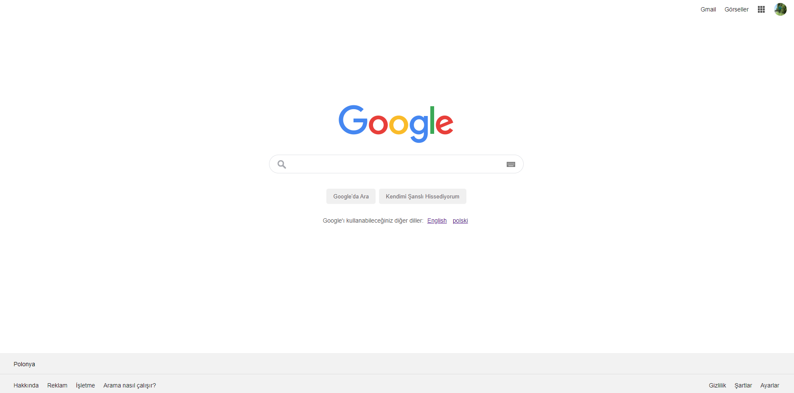

# Google Homepage Projesi
***[Patika.dev](https://www.patika.dev/tr)*** tarafindan sunulan, Başlangıç Seviye Frontend Web Development Patikası icin hazirladigim CSS konu bitirme odevimi daha yakindan inceleyebilirsiniz.

## Projeler ve Odevler 
Bu veya baska herhangi bir projemi inceleyip, daha farkli yapmam gerektigini dusundugunuz durumlarda benimle istediginiz gibi iletisim kurabilirsiniz. Elestirilere tamamen acigim. :smile: :smile:

## Peki bu odev nedir?
Daha once yapmis oldugum odevlerde -profilimden bu odevi inceleyebilirsiniz; *[eski-model-google](https://github.com/akinizm/eski-model-google.git)*- Google'in ilk versiyonu, *[Google 1998](https://web.archive.org/web/19981202230410if_/http://www.google.com/)* tasarlamistik.  Simdi ise Google'in bugunku bugünkü ana sayfasını tasarladim. 

Egitimler sirasinda ogrenmis oldugum;

        - HTML,
        - CSS,
        - GIT ve GitHub kullanimi,
        - Markdown 

gibi ogretilen konulari siklikla kullanmaya ve pratik yapmaya gayret ediyorum. Umarim bu yolda ilerlerken dogru atimlar atiyorumdur! :smiley:

`Odevin gorselini gorebilirsiniz;`

*[Patika.dev profilimi buradan ziyaret edebilirsiniz!](https://app.patika.dev/nomad)* 

